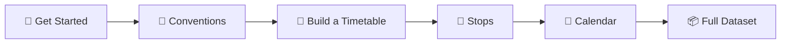

<!--
  AI AGENT NOTE: To navigate this documentation programmatically, load
  ontology/netex-nordic-documentation.ttl. Each NeTEx class is annotated with
  doc:description, doc:table, and doc:example pointing to the relevant
  markdown and XML files in this repo. Use these annotations to traverse
  from any class to its documentation instead of guessing file paths.
-->
<div align="center">

# 🚍 NeTEx Nordic Profile — Entur Implementation

**Entur's implementation documentation for Nordic public transport data**

*Timetables · Stops · Vehicles · Fares · Operations*

[]()
[](https://creativecommons.org/licenses/by/4.0/)
[]()

</div>

---

> **⚠️ Release Candidate** — This documentation is under active development. Not yet the official source.

---

## What is this?

Public transport in the Nordics runs on **NeTEx** — every timetable, stop, vehicle assignment, and fare product flows through this XML format. The [Nordic NeTEx Profile](https://enturas.atlassian.net/wiki/spaces/PUBLIC/pages/728891481/Nordic+NeTEx+Profile) constrains the full standard into a practical subset.

This repository is **Entur's implementation guide**: clear explanations, validated examples, and machine-readable rules for how to produce and consume NeTEx data in the Nordic context.

---

## 🚀 Quick start



| # | Guide | You'll learn |
|---|-------|-------------|
| 1 | **[Get Started](guides/GetStarted/GetStarted_Guide.md)** | What NeTEx is, document anatomy, frames and objects |
| 2 | **[NeTEx Conventions](guides/NeTExConventions/NeTEx_Conventions.md)** | ID patterns, versioning, codespace rules |
| 3 | **[How to Build a Timetable](guides/HowToBuildATimetable/HowToBuildATimetable_Guide.md)** | Line → Route → JourneyPattern → ServiceJourney → Departure |
| 4 | **[Stop Infrastructure](guides/StopInfrastructure/StopInfrastructure_Guide.md)** | Logical stops, physical platforms, the assignment bridge |
| 5 | **[Calendar](guides/Calendar/Calendar_Guide.md)** | DayTypes, OperatingPeriods, exceptions, date-based scheduling |

---

## 📖 Topic guides

Beyond the core reading path, these guides cover specific domains:

| Domain | Guide |
|--------|-------|
| 🔄 Interchanges & connections | [Interchange](guides/Interchange/Interchange_Guide.md) |
| 📢 Passenger information & booking | [Passenger Information](guides/PassengerInformation/PassengerInformation_Guide.md) |
| 🚌 Vehicle assignment & blocks | [Vehicle Scheduling](guides/VehicleScheduling/VehicleScheduling_Guide.md) |
| 🚆 Rolling stock & train composition | [Rolling Stock](guides/RollingStock/RollingStock_Guide.md) |
| ⚠️ Deviations & replacements | [Extended Sales & Deviations](guides/ExtendedSales_and_DeviationHandling/ExtendedSales_and_DeviationHandling_Guide.md) |
| 🛠️ Tooling & debugging | [Tools](guides/Tools/Tools_Guide.md) |

---

## 🧱 How the documentation is structured

Every NeTEx concept follows three layers:

```
objects/<Name>/
  ├── Description_<Name>.md   → What it is, when to use it, how it connects
  ├── Table_<Name>.md         → Every element, type, and cardinality per profile
  └── Example_<Name>.xml      → Minimal valid XML you can copy-paste
```

| Folder | Content |
|--------|---------|
| **[frames/](frames/)** | Frame-level containers (Description, Table, Example per frame) |
| **[objects/](objects/)** | Object-level building blocks (one folder per NeTEx class) |
| **[guides/](guides/)** | Topic guides explaining how to model specific scenarios |
| **[ontology/](ontology/)** | Machine-readable knowledge graph (Turtle/OWL) |
| **[assets/](assets/)** | Images and support files |

> 💡 Need to look up a specific element? Browse [objects/](objects/) directly or check the [Glossary](guides/Glossary/Glossary.md).

---

## 🧠 Ontology

The `ontology/` folder contains a layered knowledge graph:

- **netex.ttl** — Base NeTEx schema (classes, relationships, cardinality)
- **netex-nordic.ttl** — Nordic Profile constraints and element ordering
- **netex-entur.ttl** — Entur-specific governance (codespaces, data ownership)
- **netex-rolling-stock.ttl** — Rolling stock sub-profile

---

## 👀 Local Preview

This repository uses [Docsify](https://docsify.js.org/) for local preview:

```bash
npx docsify-cli serve .
```

---

## Contributing

Contributions welcome — especially validated examples, corrections to element tables, and new topic guides. See the existing patterns in `objects/` and `guides/` for conventions.

---

<div align="center">

**Documentation:** CC BY 4.0

</div>
