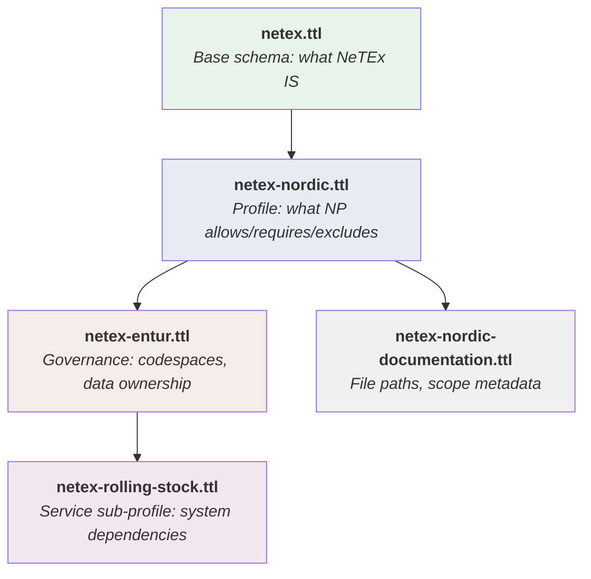

# 🧠 Ontology Guide

## 1. 🎯 Introduction

This repository includes a machine-readable ontology — a set of `.ttl` (Turtle/RDF) files that model the NeTEx schema, Nordic Profile constraints, and Entur-specific governance as structured, queryable data.

The ontology serves two purposes:
- **For humans:** a precise, navigable reference for how NeTEx classes, references, and constraints relate to each other.
- **For machines:** a foundation for automated validation (SHACL), documentation generation, and tooling integration.

**In this guide you will learn:**
- 📂 The file structure and layer stack
- 🔤 What the standard prefixes (RDF, OWL, SHACL, SKOS) mean
- 🛠️ Where and why custom properties are used
- ✅ How SHACL shapes enable validation
- 🔗 How the layers connect

---

## 2. 📂 File Structure

The `ontology/` folder contains five files, each with a distinct role:

```
ontology/
  ├── netex.ttl                      ← Base schema (classes, references, elements)
  ├── netex-nordic.ttl               ← Nordic Profile (SHACL constraints + element ordering)
  ├── netex-entur.ttl                ← Entur governance (codespaces, data ownership)
  ├── netex-rolling-stock.ttl        ← Rolling stock service sub-profile
  └── netex-nordic-documentation.ttl ← Documentation paths and scope metadata
```

### Import Chain

The files form a layered stack where each file imports the one above:



### What Each File Does

| File | Role | Contains |
|------|------|----------|
| `netex.ttl` | **Base schema** | Classes, frame containment, references between classes, XSD cardinality, SIRI bridges, Transmodel alignment |
| `netex-nordic.ttl` | **Nordic Profile** | SHACL validation shapes (excludes, requires, allows), element ordering, navigational domain chains |
| `netex-entur.ttl` | **Entur governance** | Codespace conventions (NSR, NOG, PEN), data ownership per class, Partner portal modules |
| `netex-rolling-stock.ttl` | **Service sub-profile** | Which references/elements the rolling stock service consumes/produces, service-specific SHACL constraints |
| `netex-nordic-documentation.ttl` | **Documentation layer** | Paths to Description/Table/Example files, profile scope assignments |

---

## 3. 🔤 Standard Prefixes

The ontology uses four W3C standard vocabularies. Each has a specific job:

### `rdfs:` — RDF Schema

Basic building blocks for naming and structuring things.

```turtle
netex:Line a owl:Class ;
    rdfs:label "Line" ;                  ## Human-readable name
    rdfs:subClassOf netex:Organisation . ## Inheritance
    rdfs:comment "Also used in SIRI" .   ## Free-text note
```

**Used for:** `rdfs:label`, `rdfs:subClassOf`, `rdfs:comment`, `rdfs:seeAlso`, `rdfs:range`

### `owl:` — Web Ontology Language

Formal class and property declarations with logical semantics.

```turtle
netex:Line a owl:Class .                         ## Class declaration
netex:contains a owl:ObjectProperty .             ## Relates two things
netex:xsdCardinality a owl:DatatypeProperty .     ## Relates thing to a value
netex:containedIn owl:inverseOf netex:contains .  ## Inverse relationship
```

**Used for:** `owl:Class`, `owl:ObjectProperty`, `owl:DatatypeProperty`, `owl:inverseOf`, `owl:Ontology`, `owl:imports`

### `skos:` — Simple Knowledge Organization System

Definitions and concept alignment across standards.

```turtle
netex:Line
    skos:definition "Public transport service line..." ;  ## Precise definition
    skos:exactMatch tm-journeys:Line .                    ## Same concept in Transmodel
```

**Used for:** `skos:definition`, `skos:exactMatch`, `skos:closeMatch`, `skos:notation`

### `sh:` — SHACL (Shapes Constraint Language)

Validation rules that tools can execute against real data.

```turtle
profile:NP_JourneyPatternShape a sh:NodeShape ;
    sh:targetClass netex:JourneyPattern ;
    sh:property [
        sh:path netex:JourneyPattern_RouteRef ;
        sh:minCount 1 ; sh:maxCount 1 ;       ## "Must have exactly one"
        sh:class netex:Route ;                 ## "Must point to a Route"
    ] .
```

**Used for:** `sh:NodeShape`, `sh:targetClass`, `sh:property`, `sh:path`, `sh:minCount`, `sh:maxCount`, `sh:class`, `sh:name`, `sh:description`

### Quick Reference

| Prefix | Full Name | One-line summary |
|--------|-----------|-----------------|
| `rdfs:` | RDF Schema | Names things and declares inheritance |
| `owl:` | Web Ontology Language | Declares classes and typed properties |
| `skos:` | Simple Knowledge Organization System | Defines terms and maps between vocabularies |
| `sh:` | SHACL | Validates data against rules |

---

## 4. 🛠️ Custom Properties

Some relationships in the ontology use custom `netex:` properties instead of standard vocabularies. These are all declared in `netex.ttl` with explicit type and definition.

### Why Custom?

Three reasons, depending on the property:

1. **No standard equivalent exists** — XML containment hierarchy (`netex:contains`, `netex:childOf`, `netex:inFrame`) has no RDF/OWL counterpart. There's no standard way to say "this class appears as a child element inside this frame in the XML".

2. **Standard equivalent is too verbose** — OWL cardinality requires nested blank-node `owl:Restriction` blocks. `netex:xsdCardinality "0..1"` is a flat string annotation that mirrors XSD notation directly.

3. **Standard equivalent has wrong scope** — `rdfs:domain`/`rdfs:range` apply globally to a property. `netex:onClass` and `netex:target` scope a reference to a specific relationship instance (e.g. "Line → OperatorRef targets Operator" without implying all `onClass` values are Lines).

### Structural Properties

These model the XML containment hierarchy — how classes nest inside frames and each other:

| Property | Meaning | Example |
|----------|---------|---------|
| `netex:contains` | Frame/object contains these child classes | `ResourceFrame contains Authority, Operator, ...` |
| `netex:containedIn` | Inverse of contains | `ResourceFrame containedIn CompositeFrame` |
| `netex:childOf` | Inline child element within a parent | `Quay childOf StopPlace` |
| `netex:inFrame` | Top-level member of a frame type | `Line inFrame ServiceFrame` |
| `netex:specializes` | Functional specialization | `DatedServiceJourney specializes ServiceJourney` |

### Reference Metadata Properties

These scope each named reference to its owning class and target:

| Property | Type | Meaning |
|----------|------|---------|
| `netex:onClass` | ObjectProperty | Source class that owns the reference |
| `netex:target` | ObjectProperty | Target class pointed to |
| `netex:xsdCardinality` | DatatypeProperty | Cardinality in XSD notation (e.g. `"0..1"`, `"1..n"`) |
| `netex:path` | DatatypeProperty | XPath-like path in the XML tree |
| `netex:altPath` | DatatypeProperty | Alternative path when multiple options exist |

### Example: Anatomy of a Named Reference

```turtle
netex:Line_OperatorRef a netex:Reference ;    ## Type: it's a reference
    rdfs:label "Line → OperatorRef" ;          ## Human label
    netex:onClass netex:Line ;                 ## Source: Line
    netex:target netex:Operator ;              ## Target: Operator
    netex:xsdCardinality "1..1" .              ## XSD: mandatory
```

This single resource (`netex:Line_OperatorRef`) is then referenceable from SHACL shapes, profile constraints, and service sub-profiles — all by URI.

---

## 5. ✅ SHACL Validation

SHACL shapes in `netex-nordic.ttl` and `netex-rolling-stock.ttl` express constraints that standard tools can validate automatically.

### What SHACL Expresses

| Constraint Type | SHACL Pattern | Example |
|----------------|---------------|---------|
| **Excluded** (forbidden) | `sh:maxCount 0` | `ParentSiteRef` not used in NP |
| **Allowed** (optional) | `sh:maxCount 1` | `TopographicPlaceRef` allowed but not required |
| **Required** (mandatory) | `sh:minCount 1; sh:maxCount 1` | `RouteRef` mandatory in NP (XSD says optional) |
| **Type check** | `sh:class` | `RouteRef` must point to a `Route` |

### Shape Naming Convention

| File | Pattern | Example |
|------|---------|---------|
| `netex-nordic.ttl` | `profile:NP_{ClassName}Shape` | `profile:NP_JourneyPatternShape` |
| `netex-rolling-stock.ttl` | `svc:RS_{ClassName}Shape` | `svc:RS_DatedServiceJourneyShape` |

### Layered Validation

Because the files form an import chain, constraints are additive:

1. **XSD** validates basic XML structure (element names, types, nesting)
2. **NP shapes** validate Nordic Profile rules (tighter than XSD)
3. **Service shapes** validate system-specific requirements (tighter than NP)

A DatedServiceJourney delivery to the rolling stock service must pass all three layers.

---

## 6. 🔗 How It All Connects

### From Ontology to Documentation

The `netex-nordic-documentation.ttl` file bridges the ontology to the repository's Description/Table/Example files:

```turtle
netex:ServiceJourney
    doc:description "objects/ServiceJourney/Description_ServiceJourney.md" ;
    doc:table "objects/ServiceJourney/Table_ServiceJourney.md" ;
    doc:example "objects/ServiceJourney/Example_ServiceJourney_NP.xml" .
```

This enables tools and LLM agents to navigate from a class URI to its full documentation.

### From Ontology to Validation

A SHACL shape references the same named resource that `netex.ttl` defines:

```
netex.ttl defines:     netex:JourneyPattern_RouteRef  (xsdCardinality "0..1")
                                    ↓
netex-nordic.ttl:      sh:path netex:JourneyPattern_RouteRef
                       sh:minCount 1  (NP tightens to "1..1")
```

### From Ontology to SIRI

The `netex:referencedBySIRI` property shows which NeTEx classes appear in SIRI real-time feeds:

```turtle
netex:Line netex:referencedBySIRI siri:SIRI_ET , siri:SIRI_SX , siri:SIRI_VM , siri:SIRI_FM .
```

This makes it possible to trace which NeTEx data must be stable for SIRI interoperability.

---

## 7. 📚 Further Reading

- [W3C RDF Primer](https://www.w3.org/TR/rdf11-primer/) — Introduction to RDF and Turtle syntax
- [W3C OWL 2 Overview](https://www.w3.org/TR/owl2-overview/) — Formal ontology language
- [W3C SHACL Specification](https://www.w3.org/TR/shacl/) — Shapes Constraint Language
- [W3C SKOS Reference](https://www.w3.org/TR/skos-reference/) — Simple Knowledge Organization System
- [Transmodel](https://www.transmodel-cen.eu/) — The conceptual model behind NeTEx
