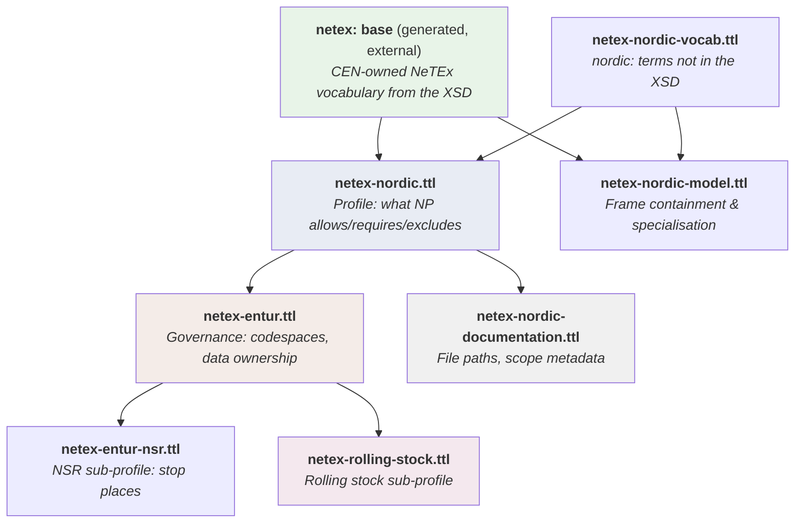

# 🧠 Ontology Guide

## 1. 🎯 Introduction

This repository includes a machine-readable ontology — a set of `.ttl` (Turtle/RDF) files that model the NeTEx schema, Nordic Profile constraints, and Entur-specific governance as structured, queryable data.

The ontology serves two purposes:
- **For humans:** a precise, navigable reference for how NeTEx classes, references, and constraints relate to each other.
- **For machines:** a foundation for automated validation (SHACL), documentation generation, and tooling integration.

**In this guide you will learn:**
- 📂 The file structure and layer stack
- 🔤 What the standard prefixes (RDF, OWL, SHACL, SKOS) mean
- 🛠️ Where and why custom properties are used
- ✅ How SHACL shapes enable validation
- 🔗 How the layers connect

---

## 2. 📂 File Structure

The `ontology/` folder contains a documentation-specific file alongside the [`entur-netex-ontology`](https://github.com/entur/entur-netex-ontology) submodule (the single source of truth for all non-documentation ontology files):

```
ontology/
  ├── entur-netex-ontology/            ← git submodule (https://github.com/entur/entur-netex-ontology)
  │   ├── netex-entur.ttl                    ← Entur governance (codespaces, data ownership)
  │   ├── netex-entur-nsr.ttl                ← Entur NSR sub-profile (stop places)
  │   ├── netex-rolling-stock.ttl            ← Rolling stock service sub-profile
  │   └── nordic-netex-ontology/             ← nested submodule (https://github.com/entur/nordic-netex-ontology)
  │       ├── netex-nordic.ttl               ← Nordic Profile (SHACL constraints + element ordering)
  │       ├── netex-nordic-vocab.ttl         ← Nordic vocabulary (nordic:) — terms not in the XSD
  │       ├── netex-nordic-model.ttl         ← Curated frame containment & specialisation
  │       ├── netex-transmodel-alignment.ttl ← NeTEx ⇄ Transmodel mapping (skos)
  │       └── netex-siri-bridge.ttl          ← NeTEx ⇄ SIRI real-time bridges
  └── netex-nordic-documentation.ttl   ← Documentation paths and scope metadata
```

> ℹ️ The NeTEx **base vocabulary** (`netex:`) is now **generated from the NeTEx XSD** and owned externally (CEN). It is pulled in via `owl:imports <https://netex-cen.eu/ontology>` but is **not stored in this repository** — there is no `netex.ttl` file in the submodule.

### Import Chain

The files form a layered stack where each file imports the one above:



> `netex-transmodel-alignment.ttl` and `netex-siri-bridge.ttl` sit in the Nordic layer beside `netex-nordic-model.ttl`, adding `skos` alignment to Transmodel and the NeTEx ⇄ SIRI bridge respectively.

### What Each File Does

| File | Role | Contains |
|------|------|----------|
| `netex:` base (external) | **Generated base** | OWL classes + `lowerCamelCase` properties + XSD cardinality/sequence, projected from the NeTEx XSD (CEN-owned) |
| `netex-nordic.ttl` | **Nordic Profile** | SHACL validation shapes (excludes, requires, allows), element ordering |
| `netex-nordic-vocab.ttl` | **Nordic vocabulary** | `nordic:` terms not derived from the XSD (profile meta-classes, data confidence, ordering, domain chains, structural predicates, SIRI bridge property) |
| `netex-nordic-model.ttl` | **Nordic model** | Curated frame containment (`nordic:contains`/`inFrame`/`childOf`) and functional specialisation (`nordic:specializes`) |
| `netex-transmodel-alignment.ttl` | **Alignment** | `skos` mapping from NeTEx classes to Transmodel concepts |
| `netex-siri-bridge.ttl` | **SIRI bridge** | Which NeTEx classes are referenced by SIRI real-time services |
| `netex-entur.ttl` | **Entur governance** | Codespace conventions (NSR, NOG, PEN), data ownership per class, Partner portal modules |
| `netex-entur-nsr.ttl` | **NSR sub-profile** | Authoritative stop place profile (Tiamat export, hierarchy rules, keyList conventions) |
| `netex-rolling-stock.ttl` | **Rolling stock sub-profile** | Which references/elements the rolling stock service consumes/produces, service-specific SHACL constraints |
| `netex-nordic-documentation.ttl` | **Documentation layer** | Paths to Description/Table/Example files, profile scope assignments |

---

## 3. 🔤 Standard Prefixes

The ontology uses four W3C standard vocabularies. Each has a specific job:

### `rdfs:` — RDF Schema

Basic building blocks for naming and structuring things.

```turtle
netex:Line a owl:Class ;
    rdfs:label "Line" ;                  ## Human-readable name
    rdfs:subClassOf netex:Organisation . ## Inheritance
    rdfs:comment "Also used in SIRI" .   ## Free-text note
```

**Used for:** `rdfs:label`, `rdfs:subClassOf`, `rdfs:comment`, `rdfs:seeAlso`, `rdfs:range`

### `owl:` — Web Ontology Language

Formal class and property declarations with logical semantics.

```turtle
netex:Line a owl:Class .                             ## Class declaration
nordic:contains a owl:ObjectProperty .              ## Relates two things
nordic:position a owl:DatatypeProperty .            ## Relates thing to a value
nordic:containedIn owl:inverseOf nordic:contains .  ## Inverse relationship
```

**Used for:** `owl:Class`, `owl:ObjectProperty`, `owl:DatatypeProperty`, `owl:inverseOf`, `owl:Ontology`, `owl:imports`

### `skos:` — Simple Knowledge Organization System

Definitions and concept alignment across standards.

```turtle
netex:Line
    skos:definition "Public transport service line..." ;  ## Precise definition
    skos:exactMatch tm-journeys:Line .                    ## Same concept in Transmodel
```

**Used for:** `skos:definition`, `skos:exactMatch`, `skos:closeMatch`, `skos:notation`

### `sh:` — SHACL (Shapes Constraint Language)

Validation rules that tools can execute against real data.

```turtle
profile:NP_JourneyPatternShape a sh:NodeShape ;
    sh:targetClass netex:JourneyPattern ;
    sh:property [
        sh:path netex:routeRef ;
        sh:minCount 1 ; sh:maxCount 1 ;       ## "Must have exactly one"
        sh:class netex:Route ;                 ## "Must point to a Route"
    ] .
```

**Used for:** `sh:NodeShape`, `sh:targetClass`, `sh:property`, `sh:path`, `sh:minCount`, `sh:maxCount`, `sh:class`, `sh:name`, `sh:description`

### Quick Reference

| Prefix | Full Name | One-line summary |
|--------|-----------|-----------------|
| `rdfs:` | RDF Schema | Names things and declares inheritance |
| `owl:` | Web Ontology Language | Declares classes and typed properties |
| `skos:` | Simple Knowledge Organization System | Defines terms and maps between vocabularies |
| `sh:` | SHACL | Validates data against rules |

Alongside these, four **domain namespaces** carry the model itself:

| Prefix | Namespace | Owner | Role |
|--------|-----------|-------|------|
| `netex:` | `https://netex-cen.eu/ontology#` | CEN (generated from XSD) | Base classes & properties |
| `nordic:` | `https://netex-cen.eu/nordic#` | Nordic editorial team | Profile vocabulary, structural model, SIRI bridge |
| `profile:` | `https://netex-cen.eu/profile#` | Nordic editorial team | Profile definition & SHACL shapes |
| `entur:` | `https://entur.org/ontology#` | Entur | Governance, codespaces, sub-profiles |

---

## 4. 🛠️ Custom Properties

Beyond the standard W3C vocabularies, the ontology relies on two families of domain terms: **generated `netex:` properties** projected 1:1 from the NeTEx XSD (`lowerCamelCase`, e.g. `netex:routeRef`) that live in the external CEN-owned base, and **hand-authored `nordic:` predicates** for profile navigation, declared in `netex-nordic-vocab.ttl` and applied in `netex-nordic-model.ttl`.

### Why a Separate `nordic:` Namespace?

The generated base intentionally mints **no terms beyond the XSD**, so anything the profile invents lives in `nordic:` — keeping the CEN-owned `netex:` namespace clean and regenerable.

1. **No XSD equivalent exists** — the XML containment hierarchy (`nordic:contains`, `nordic:childOf`, `nordic:inFrame`) has no counterpart in the schema. There's no standard way to say "this class appears as a child element inside this frame in the XML".

2. **Functional specialisation, deliberately not `rdfs:subClassOf`** — `nordic:specializes` records that e.g. `DatedServiceJourney` specialises `ServiceJourney` without letting a reasoner infer a true IS-A hierarchy the standard never formalised.

3. **XSD cardinality lives in the generated base** — the base carries cardinality and element sequence via `owl:Restriction`, so the profile no longer maintains hand-written named-reference resources.

### Structural Predicates (`nordic:`)

These model the XML containment hierarchy — how classes nest inside frames and each other. Declared in `netex-nordic-vocab.ttl`, asserted on generated `netex:` classes in `netex-nordic-model.ttl`:

| Property | Meaning | Example |
|----------|---------|---------|
| `nordic:contains` | Frame/object contains these child classes | `ResourceFrame contains Authority, Operator, …` |
| `nordic:containedIn` | Inverse of contains | `ResourceFrame containedIn CompositeFrame` |
| `nordic:childOf` | Inline child element within a parent | `Quay childOf StopPlace` |
| `nordic:inFrame` | Top-level member of a frame type | `Line inFrame ServiceFrame` |
| `nordic:specializes` | Functional specialization (not `rdfs:subClassOf`) | `DatedServiceJourney specializes ServiceJourney` |

### Generated Reference Properties (`netex:`)

Named references are **no longer hand-modelled**. Each reference is a generated `lowerCamelCase` property projected from the XSD, and profile constraints target it directly by URI:

```turtle
## Generated base (external): the property exists, projected 1:1 from the XSD
netex:routeRef a owl:ObjectProperty .

## netex-nordic.ttl: a SHACL shape tightens it for the profile
profile:NP_JourneyPatternShape a sh:NodeShape ;
    sh:targetClass netex:JourneyPattern ;
    sh:property [
        sh:path netex:routeRef ;         ## the generated property
        sh:minCount 1 ; sh:maxCount 1 ;  ## NP mandates 1..1 (XSD allows 0..1)
        sh:class netex:Route
    ] .
```

SHACL shapes, profile constraints, and service sub-profiles all reference these generated properties by URI.

---

## 5. ✅ SHACL Validation

SHACL shapes in `netex-nordic.ttl`, `netex-entur-nsr.ttl`, and `netex-rolling-stock.ttl` express constraints that standard tools can validate automatically.

### What SHACL Expresses

| Constraint Type | SHACL Pattern | Example |
|----------------|---------------|---------|
| **Excluded** (forbidden) | `sh:maxCount 0` | `ParentSiteRef` not used in NP |
| **Allowed** (optional) | `sh:maxCount 1` | `TopographicPlaceRef` allowed but not required |
| **Required** (mandatory) | `sh:minCount 1; sh:maxCount 1` | `RouteRef` mandatory in NP (XSD says optional) |
| **Type check** | `sh:class` | `RouteRef` must point to a `Route` |

### Shape Naming Convention

| File | Pattern | Example |
|------|---------|---------|
| `netex-nordic.ttl` | `profile:NP_{ClassName}Shape` | `profile:NP_JourneyPatternShape` |
| `netex-entur-nsr.ttl` | `nsr:NSR_{ClassName}Shape` | `nsr:NSR_StopPlaceShape` |
| `netex-rolling-stock.ttl` | `svc:RS_{ClassName}Shape` | `svc:RS_DatedServiceJourneyShape` |

### Layered Validation

Because the files form an import chain, constraints are additive:

1. **XSD** validates basic XML structure (element names, types, nesting)
2. **NP shapes** validate Nordic Profile rules (tighter than XSD)
3. **Service shapes** validate system-specific requirements (tighter than NP)

A DatedServiceJourney delivery to the rolling stock service must pass all three layers.

---

## 6. 🔗 How It All Connects

### From Ontology to Documentation

The `netex-nordic-documentation.ttl` file bridges the ontology to the repository's Description/Table/Example files:

```turtle
netex:ServiceJourney
    doc:description "objects/ServiceJourney/Description_ServiceJourney.md" ;
    doc:table "objects/ServiceJourney/Table_ServiceJourney.md" ;
    doc:example "objects/ServiceJourney/Example_ServiceJourney_NP.xml" .
```

This enables tools and LLM agents to navigate from a class URI to its full documentation.

### From Ontology to Validation

A SHACL shape references a generated property from the (external) NeTEx base:

```
generated base:   netex:routeRef        (XSD cardinality 0..1, via owl:Restriction)
                              ↓
netex-nordic.ttl: sh:path netex:routeRef
                  sh:minCount 1          (NP tightens to 1..1)
```

### From Ontology to SIRI

The `nordic:referencedBySIRI` property (declared in `netex-nordic-vocab.ttl`, asserted in `netex-siri-bridge.ttl`) shows which NeTEx classes appear in SIRI real-time feeds:

```turtle
netex:Line nordic:referencedBySIRI siri:SIRI_ET , siri:SIRI_SX , siri:SIRI_VM , siri:SIRI_FM .
```

This makes it possible to trace which NeTEx data must be stable for SIRI interoperability.

---

## 7. 📚 Further Reading

- [W3C RDF Primer](https://www.w3.org/TR/rdf11-primer/) — Introduction to RDF and Turtle syntax
- [W3C OWL 2 Overview](https://www.w3.org/TR/owl2-overview/) — Formal ontology language
- [W3C SHACL Specification](https://www.w3.org/TR/shacl/) — Shapes Constraint Language
- [W3C SKOS Reference](https://www.w3.org/TR/skos-reference/) — Simple Knowledge Organization System
- [Transmodel](https://www.transmodel-cen.eu/) — The conceptual model behind NeTEx
